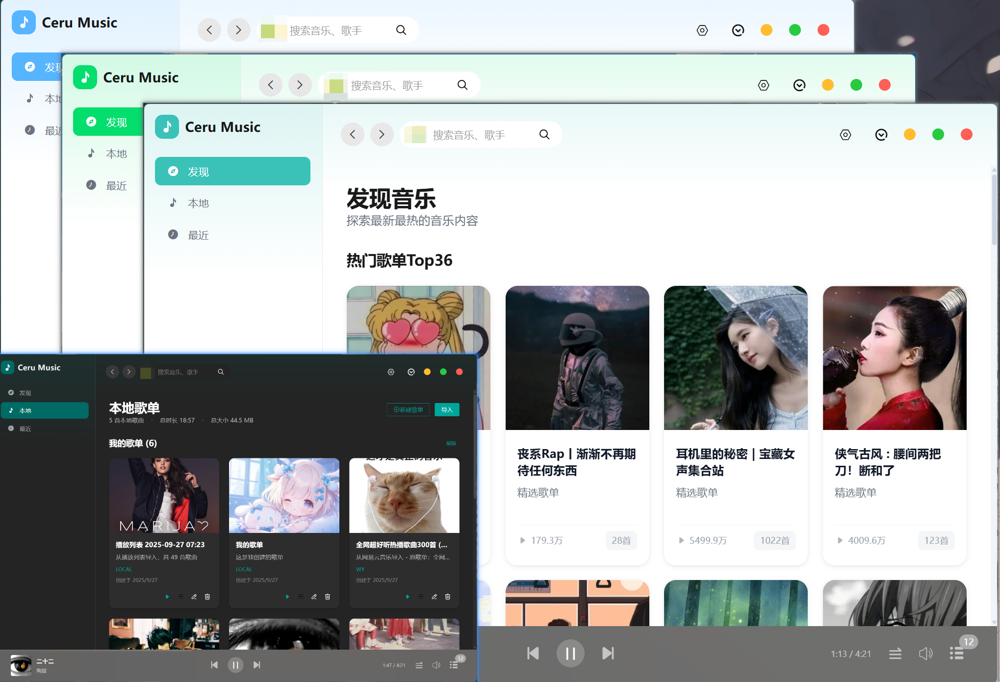
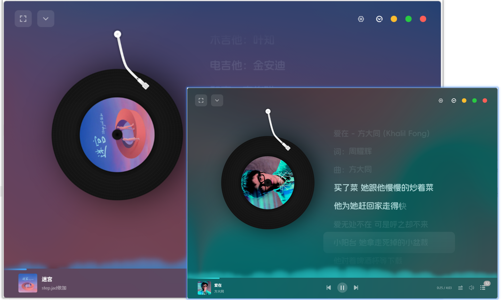

# Ceru Music（澜音）维护版

Ceru Music 是基于 Electron、Vue 3 和 TypeScript 开发的跨平台桌面音乐播放器。
项目提供音乐检索、播放、歌单、本地音乐、下载管理及插件运行框架，本身不附带音乐源插件，也不存储或分发音乐文件。





## 维护版说明

本仓库在原项目代码基础上持续维护，重点是提高常用流程的稳定性并减少失效的外围依赖。
这些说明描述长期行为，不绑定某个临时版本号。

- 加强音乐搜索、搜索建议、发现页和歌单详情的请求重试、异常响应处理与并发隔离。
- 修复 QQ 音乐搜索空结果误判、歌单详情接口失效以及大型歌单分页不完整的问题。
- 修复快速切换关键词、音源或页面时，较早请求覆盖新结果的竞态问题。
- 搜索框增加明确的清空入口；立即播放的新歌曲统一加入当前播放列表顶部。
- 下载流程对缺失的文件大小、歌词或附加元数据进行容错，避免非关键数据导致整个任务失败。
- 移除应用内自动更新、更新服务器及其相关界面。新版本通过 GitHub Releases 发布，由用户自行下载安装。
- 关于页面仅保留运行环境、版本信息和法律声明，移除维护团队、技术宣传与联系方式展示。

## 数据兼容

维护版沿用原应用的 `appId`、产品名称和 Electron 用户数据目录，以便升级后继续使用已有配置。
因此，在同一台电脑上运行原版、维护版或免安装测试版时，可能会看到相同的音源插件、播放列表、播放记录、主题和下载设置。

常见数据包括：

- 渲染进程 `localStorage` 中的音源选择、当前播放列表、播放进度和界面设置。
- Electron 用户数据目录中的插件、歌单数据库、本地音乐索引、下载记录和缓存。
- 默认下载目录中的歌曲文件与歌词文件。

这种兼容行为可以避免升级丢失数据，但也意味着在测试版中修改或删除这些内容，可能影响同一用户数据目录下的其他 Ceru Music 构建。

## 主要功能

- 多音源搜索、搜索建议、歌单发现、排行榜和歌单详情。
- 当前播放列表管理、拖拽排序、播放模式、歌词和系统媒体控制。
- 本地音乐扫描、标签编辑、本地歌单和歌单导入导出。
- 下载队列、失败重试、目录与文件名规则设置。
- 用户自行安装的合规音乐插件及多音质选择。
- 主题、音频效果、桌面歌词和一起听等扩展功能。

部分在线功能依赖外部服务；服务不可用时，不影响本地音乐和已经保存在本机的数据。

## 技术栈

- Electron：桌面窗口、系统集成、IPC 和本地文件能力。
- Vue 3：渲染进程界面与交互。
- TypeScript：主进程、预加载脚本和渲染进程类型约束。
- Pinia：播放状态、设置和用户数据状态管理。
- Vite / electron-vite：开发服务器与生产构建。
- better-sqlite3：本地歌单和音乐索引数据库。
- CeruPlugins：用户插件运行与音源能力适配。

## 项目结构

```text
CeruMusic/
├── src/
│   ├── main/       # Electron 主进程、IPC、音乐 SDK、下载与插件服务
│   ├── preload/    # 暴露给渲染进程的受控 API
│   ├── renderer/   # Vue 界面、Pinia store、播放器和业务页面
│   └── common/     # 主进程与渲染进程共享的类型和工具
├── resources/      # 应用图标和运行时资源
├── build/          # 安装器与平台构建配置
├── docs/           # VitePress 文档
├── scripts/        # 开发与发布辅助脚本
├── electron-builder.yml
└── package.json
```

## 开发与构建

推荐使用 Node.js 22 和 Yarn。

```bash
# 安装依赖
yarn install

# 启动 Electron 开发环境
yarn dev

# 类型检查并构建应用代码
yarn build

# 运行测试
yarn test

# 构建当前平台安装包
yarn build:win
yarn build:mac
yarn build:linux

# 构建文档
yarn docs:build
```

构建产物仅包含播放器和插件运行框架。音乐插件及其数据来源由用户自行选择，并应符合所在地区法律、数据来源平台协议和相关版权要求。

## 发布

仓库使用 Git 标签触发 GitHub Actions 跨平台构建，并将安装包上传到 GitHub Releases。
应用不执行后台版本检查，也不会自行下载或安装更新。完整流程见 [发版指南](docs/guide/release.md)。

## 文档

- [使用与开发文档](docs/)
- [插件开发规范](docs/guide/CeruMusicPluginDev.md)
- [发版指南](docs/guide/release.md)
- [常见问题](docs/guide/faq.md)

## 开源许可与第三方组件

项目源代码遵循 [GNU AGPL v3.0](LICENSE)。该许可适用于本仓库代码，不构成对音乐、歌词、专辑封面、艺人信息或第三方服务数据的授权。

歌词界面使用 [applemusic-like-lyrics](https://github.com/Steve-xmh/applemusic-like-lyrics)，其代码和分发需同时遵循对应的上游许可。

## 合规与免责声明

- 本项目是播放器与插件运行框架，不提供音乐文件或默认音乐源插件。
- 用户应确保所安装插件、访问的数据及下载行为具有合法授权，并遵守第三方平台协议。
- 不得将本项目与侵权插件、未授权内容或其他违法用途捆绑传播。
- 本地配置、播放记录、歌单和缓存由用户自行保管；测试、卸载或清理数据前请先备份重要内容。
- 软件按开源许可证“原样”提供，不对外部服务持续可用性或第三方数据准确性作保证。

## 贡献

欢迎提交播放器框架优化、稳定性修复、测试和文档改进。提交前请运行类型检查与相关测试，并避免提交账号凭据、私人插件、缓存、下载文件或其他仅属于本机的数据。
